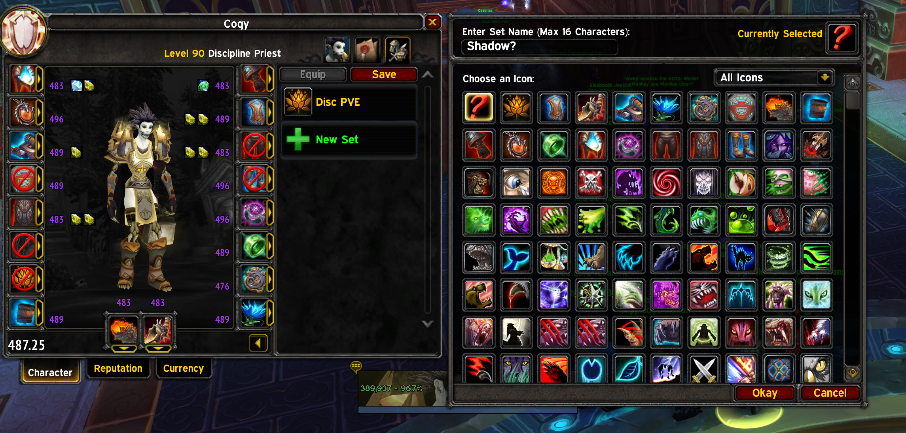
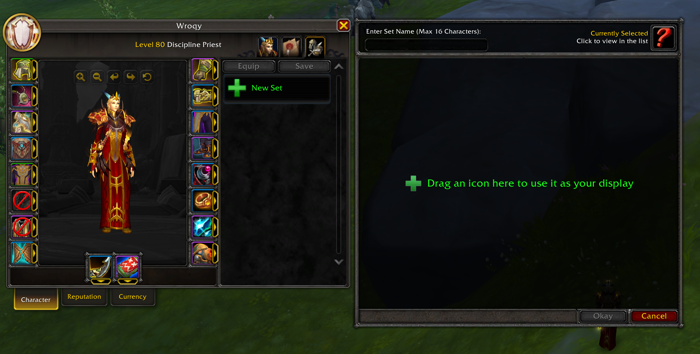

# EquipmentManagerClassic
GUI for Blizzard's EquipmentManager in Classic.  
Do you also have an annoying time on your Rank 14 warrior when you have to weapon swap to 2 weapons with the same name? Look no further! This is the addon you are looking for.  

# How to use
`/emc`

## `/emc help`, `/emc h`, `/emc ?`
Print all the available commands

## `/emc sets`, `/emc s`
Prints all EquipmentSet IDs

## `/emc <setID>`, `/emc s <setID>`
Print all items in the given set

# Development
Discovered that you can use wow's API for equipmentset in Vanilla (Anniversary), and this works in combat, and therefore it is interesting.  

[API Namespace/C_EquipmentSet](https://warcraft.wiki.gg/wiki/Category:API_systems/EquipmentSet)  
[Blizzard API Documentation](https://www.townlong-yak.com/framexml/live/Blizzard_APIDocumentation#)  
[Ace3 Library](https://www.wowace.com/projects/ace3/pages)  

## Idea
Make an addon that let's you view all your EquipmentSet, create them, edit, change icon and give access to the button that can be place on your action bar.

### Functions  
  - [x] View saved EquipmentSets
  - [ ] Create new EquipmentSet (with currently equipped geared, and choose which slots to ignore)
  - [ ] Edit Icon for an EquipmentSet
  - [ ] Get actionbar Button for EquipmentSet
  - [ ] Get/show macro string for EquipmentSet
  - [ ] (Optional) reate a WA that shows if specific EquipmentSet is equipped
  - [ ] Consider getting inspiration from retail/classic Equipmentmanager for UI, screenshot below

  
  

## Script examples:
**Create/save an EquipmentSet that only contains weapons (ignore other slots):**  
`/run local set = "Cleaver" local c = C_EquipmentSet c.CreateEquipmentSet(set) for i = 1,19 do if i ~= 16 and i ~= 17 then c.IgnoreSlotForSave(i) end end c.SaveEquipmentSet(c.GetEquipmentSetID(set))`  

**Pickup the "button" for the EquipmentSet:**  
`/run local set = "Cleaver" local c = C_EquipmentSet c.PickupEquipmentSet(c.GetEquipmentSetID(set))`  

**Print items in the EquipmentSet with ID '0':**  
`/run local items = C_EquipmentSet.GetItemIDs(0) for i = 1,19 do if items[i] then print(i, (GetItemInfo(items[i]))) end end`  

**Add icon '236316' to EquipmentSet with ID '0' and give it name "Cleaver":**  
`/run C_EquipmentSet.ModifyEquipmentSet(0, "Cleaver", 236316)`  

**Print IDs of all EquipmentSets:**  
`/run local c = C_EquipmentSet print(table.concat(c.GetEquipmentSetIDs(), ", "))`  

**Print EquipmentSetInfo for EquipmentSet with ID '0':**  
`/run print(C_EquipmentSet.GetEquipmentSetInfo(0))`  

**Print EquipmentSetID for spec index '0' (I do not know if other related EquipmentSet+Spec functions work for Anniversary):**  
`/run print(C_EquipmentSet.GetEquipmentSetForSpec(0))`  

